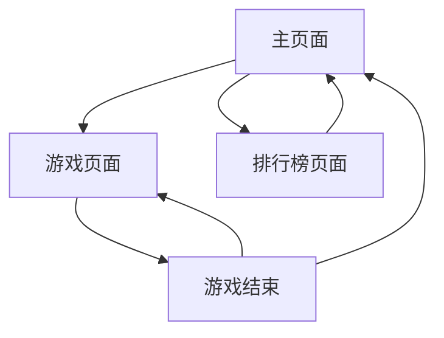

## 1. 产品概述
3D扫雷是一款创新的立体扫雷游戏，将传统的2D扫雷体验扩展到三维空间。玩家需要在3D立方体网格中找出所有地雷，通过逻辑推理和标记来完成游戏。这款游戏为经典扫雷爱好者提供全新的挑战和视觉体验。

目标用户：喜欢益智游戏、扫雷爱好者、寻求3D游戏体验的玩家。

## 2. 核心功能

### 2.1 用户角色
| 角色 | 注册方式 | 核心权限 |
|------|----------|----------|
| 游客用户 | 无需注册 | 开始游戏、选择难度、查看排行榜 |
| 注册用户 | 邮箱注册 | 保存游戏记录、参与排行榜、自定义设置 |

### 2.2 功能模块
游戏包含以下主要页面：
1. **主页面**：游戏标题、开始游戏按钮、难度选择、设置选项。
2. **游戏页面**：3D游戏区域、计时器、地雷计数器、暂停/重置按钮。
3. **排行榜页面**：显示最佳成绩、难度分类、全球排名。

### 2.3 页面详情
| 页面名称 | 模块名称 | 功能描述 |
|----------|----------|----------|
| 主页面 | 游戏标题 | 显示3D扫雷标题和logo动画 |
| 主页面 | 难度选择 | 提供5x5x5、8x8x8、10x10x10三种难度选项 |
| 主页面 | 开始游戏 | 点击后进入游戏页面 |
| 主页面 | 设置选项 | 音效开关、视觉效果、控制方式设置 |
| 游戏页面 | 3D游戏区域 | 显示可旋转的3D立方体网格，支持鼠标拖拽旋转和缩放 |
| 游戏页面 | 游戏信息栏 | 显示剩余地雷数、游戏时间、当前难度 |
| 游戏页面 | 控制按钮 | 暂停/继续、重新开始、返回主页 |
| 游戏页面 | 游戏状态 | 显示胜利/失败提示，提供重新开始选项 |
| 排行榜页面 | 最佳成绩 | 按难度分类显示最快通关时间 |
| 排行榜页面 | 个人记录 | 显示用户历史最佳成绩 |

## 3. 核心流程

### 游戏流程
1. 用户进入主页面，选择游戏难度
2. 点击开始游戏，加载3D游戏场景
3. 玩家通过鼠标点击立方体进行挖掘，右键标记地雷
4. 系统根据3D邻居规则（26个邻居）显示数字
5. 玩家完成游戏或触发地雷，显示游戏结果
6. 玩家可以选择重新开始或返回主页

### 页面导航流程图

## 4. 用户界面设计

### 4.1 设计风格
- **主色调**：深蓝色（#1a365d）和橙色（#ed8936）
- **按钮风格**：圆角矩形，3D悬浮效果
- **字体**：无衬线字体，标题使用较大字号（32px），正文使用中等字号（16px）
- **布局风格**：居中布局，卡片式设计
- **图标风格**：使用3D立体图标，与游戏主题呼应

### 4.2 页面设计概述
| 页面名称 | 模块名称 | UI元素 |
|----------|----------|--------|
| 主页面 | 游戏标题 | 3D旋转的立方体logo，渐变背景，动态光影效果 |
| 主页面 | 难度选择 | 三个卡片式选项，显示网格大小和地雷数量 |
| 游戏页面 | 3D游戏区域 | 占据屏幕主要区域，支持鼠标拖拽旋转，滚轮缩放 |
| 游戏页面 | 游戏信息栏 | 顶部固定位置，半透明背景，显示实时数据 |
| 游戏页面 | 控制按钮 | 底部工具栏，图标按钮设计 |

### 4.3 响应式设计
- **桌面优先**：主要面向桌面用户，大屏幕体验最佳
- **移动端适配**：支持触摸操作，简化控制界面
- **交互优化**：支持键盘快捷键（空格暂停、R键重新开始）

### 4.4 3D场景指导
- **环境设置**：使用深色渐变背景，营造专注的游戏氛围
- **光照系统**：三点光照（主光、补光、轮廓光），强度适中
- **相机控制**：初始位置在斜上方45度，支持轨道控制和平滑过渡
- **立方体设计**：统一尺寸，未挖掘状态为深色，挖掘后显示数字或地雷
- **动画效果**：立方体翻转动画，胜利时的粒子效果，失败时的震动效果
- **性能优化**：使用实例化渲染，限制同时显示的立方体数量