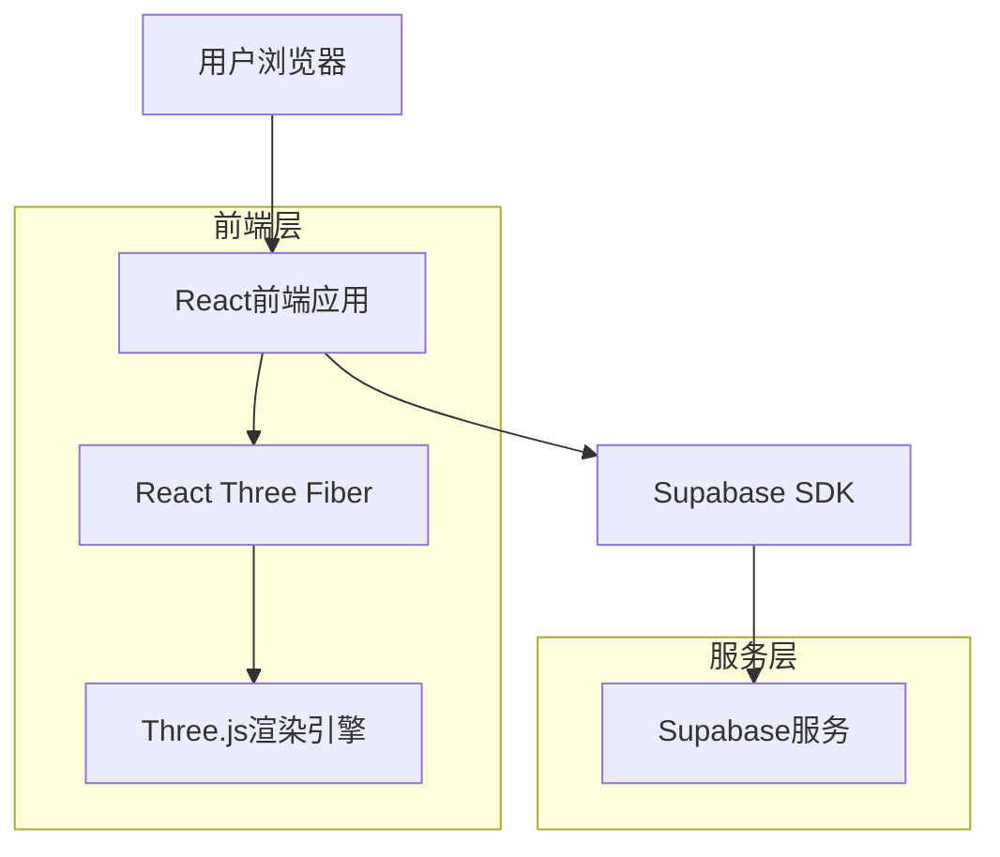
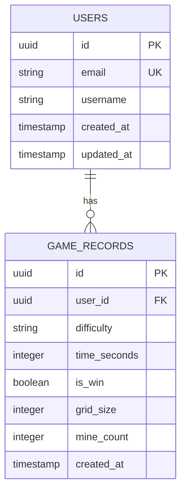

## 1. 架构设计



## 2. 技术描述

- **前端框架**：React@18 + TypeScript + Vite
- **3D渲染**：@react-three/fiber@8 + @react-three/drei@9 + three@0.158
- **样式框架**：tailwindcss@3
- **初始化工具**：vite-init
- **后端服务**：Supabase（PostgreSQL数据库）
- **状态管理**：React Context API + useReducer
- **动画库**：@react-spring/three

## 3. 路由定义

| 路由 | 用途 |
|------|------|
| / | 主页面，显示游戏标题和难度选择 |
| /game | 游戏页面，3D扫雷游戏主界面 |
| /leaderboard | 排行榜页面，显示最佳成绩 |
| /settings | 设置页面，音效和视觉效果配置 |

## 4. 核心API定义

### 4.1 游戏数据API

#### 获取排行榜数据
```
GET /api/leaderboard
```

请求参数：
| 参数名 | 参数类型 | 是否必需 | 描述 |
|--------|----------|----------|------|
| difficulty | string | false | 难度等级（easy/medium/hard） |
| limit | number | false | 返回记录数量，默认10 |

响应：
```json
{
  "data": [
    {
      "id": "uuid",
      "username": "玩家名称",
      "difficulty": "medium",
      "time": 185,
      "created_at": "2024-01-01T00:00:00Z"
    }
  ]
}
```

#### 保存游戏记录
```
POST /api/game-record
```

请求体：
```json
{
  "difficulty": "medium",
  "time": 185,
  "is_win": true
}
```

### 4.2 游戏状态类型定义

```typescript
interface GameCell {
  id: string;
  x: number;
  y: number;
  z: number;
  isMine: boolean;
  isRevealed: boolean;
  isFlagged: boolean;
  neighborCount: number;
}

interface GameState {
  cells: GameCell[];
  gameStatus: 'playing' | 'won' | 'lost' | 'ready';
  difficulty: 'easy' | 'medium' | 'hard';
  gridSize: number;
  mineCount: number;
  revealedCount: number;
  flaggedCount: number;
  startTime: number | null;
  endTime: number | null;
}

interface DifficultyConfig {
  easy: { size: 5, mines: 15 };
  medium: { size: 8, mines: 64 };
  hard: { size: 10, mines: 125 };
}
```

## 5. 数据模型

### 5.1 数据模型定义



### 5.2 数据定义语言

#### 用户表（users）
```sql
-- 创建用户表
CREATE TABLE users (
    id UUID PRIMARY KEY DEFAULT gen_random_uuid(),
    email VARCHAR(255) UNIQUE NOT NULL,
    username VARCHAR(50) NOT NULL,
    created_at TIMESTAMP WITH TIME ZONE DEFAULT NOW(),
    updated_at TIMESTAMP WITH TIME ZONE DEFAULT NOW()
);

-- 创建索引
CREATE INDEX idx_users_email ON users(email);
CREATE INDEX idx_users_username ON users(username);
```

#### 游戏记录表（game_records）
```sql
-- 创建游戏记录表
CREATE TABLE game_records (
    id UUID PRIMARY KEY DEFAULT gen_random_uuid(),
    user_id UUID REFERENCES users(id) ON DELETE CASCADE,
    difficulty VARCHAR(10) NOT NULL CHECK (difficulty IN ('easy', 'medium', 'hard')),
    time_seconds INTEGER NOT NULL CHECK (time_seconds > 0),
    is_win BOOLEAN NOT NULL,
    grid_size INTEGER NOT NULL CHECK (grid_size > 0),
    mine_count INTEGER NOT NULL CHECK (mine_count > 0),
    created_at TIMESTAMP WITH TIME ZONE DEFAULT NOW()
);

-- 创建索引
CREATE INDEX idx_game_records_user_id ON game_records(user_id);
CREATE INDEX idx_game_records_difficulty ON game_records(difficulty);
CREATE INDEX idx_game_records_time ON game_records(time_seconds);
CREATE INDEX idx_game_records_created_at ON game_records(created_at DESC);
```

#### Supabase访问权限设置
```sql
-- 授予匿名用户读取权限
GRANT SELECT ON game_records TO anon;
GRANT SELECT ON users TO anon;

-- 授予认证用户完整权限
GRANT ALL PRIVILEGES ON game_records TO authenticated;
GRANT ALL PRIVILEGES ON users TO authenticated;

-- 创建行级安全策略
ALTER TABLE game_records ENABLE ROW LEVEL SECURITY;
ALTER TABLE users ENABLE ROW LEVEL SECURITY;

-- 游戏记录策略
CREATE POLICY "公开读取游戏记录" ON game_records
    FOR SELECT USING (true);

CREATE POLICY "用户只能插入自己的记录" ON game_records
    FOR INSERT WITH CHECK (auth.uid() = user_id);

CREATE POLICY "用户可以更新自己的记录" ON game_records
    FOR UPDATE USING (auth.uid() = user_id);
```

## 6. 3D游戏逻辑实现

### 6.1 3D邻居计算
```typescript
function get3DNeighbors(x: number, y: number, z: number, gridSize: number): Position[] {
  const neighbors: Position[] = [];
  
  for (let dx = -1; dx <= 1; dx++) {
    for (let dy = -1; dy <= 1; dy++) {
      for (let dz = -1; dz <= 1; dz++) {
        if (dx === 0 && dy === 0 && dz === 0) continue;
        
        const nx = x + dx;
        const ny = y + dy;
        const nz = z + dz;
        
        if (nx >= 0 && nx < gridSize && 
            ny >= 0 && ny < gridSize && 
            nz >= 0 && nz < gridSize) {
          neighbors.push({ x: nx, y: ny, z: nz });
        }
      }
    }
  }
  
  return neighbors; // 最多26个邻居
}
```

### 6.2 游戏状态管理
```typescript
const gameReducer = (state: GameState, action: GameAction): GameState => {
  switch (action.type) {
    case 'INITIALIZE_GAME':
      return initializeGame(action.payload.difficulty);
    case 'REVEAL_CELL':
      return revealCell(state, action.payload.position);
    case 'TOGGLE_FLAG':
      return toggleFlag(state, action.payload.position);
    case 'GAME_WON':
      return { ...state, gameStatus: 'won', endTime: Date.now() };
    case 'GAME_LOST':
      return { ...state, gameStatus: 'lost', endTime: Date.now() };
    default:
      return state;
  }
};
```

## 7. 性能优化策略

- **实例化渲染**：使用InstancedMesh批量渲染相同几何体
- **视锥体剔除**：只渲染相机视野内的立方体
- **LOD系统**：远距离使用低多边形模型
- **纹理压缩**：使用压缩纹理格式减少内存占用
- **动画优化**：使用React.memo和useMemo避免不必要的重渲染