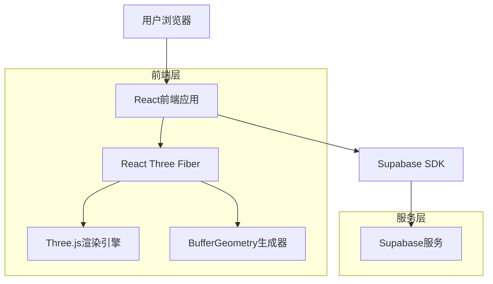
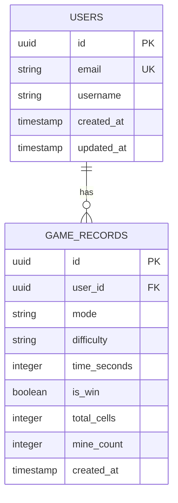

## 1. 架构设计



## 2. 技术描述

- **前端框架**：React@18 + TypeScript + Vite
- **3D渲染**：@react-three/fiber@8 + @react-three/drei@9 + three@0.158
- **样式框架**：tailwindcss@3
- **初始化工具**：vite-init
- **后端服务**：Supabase（PostgreSQL数据库）
- **状态管理**：React Context API + useReducer
- **动画库**：@react-spring/three
- **几何生成**：自定义BufferGeometry生成器用于球体表面

## 3. 路由定义

| 路由 | 用途 |
|------|------|
| / | 主页面，显示游戏标题和模式选择 |
| /game/cube | 立方体表面模式游戏页面 |
| /game/sphere | 球体表面模式游戏页面 |
| /leaderboard | 排行榜页面，显示最佳成绩 |
| /settings | 设置页面，音效和视觉效果配置 |

## 4. 核心API定义

### 4.1 游戏数据API

#### 获取排行榜数据
```
GET /api/leaderboard
```

请求参数：
| 参数名 | 参数类型 | 是否必需 | 描述 |
|--------|----------|----------|------|
| mode | string | false | 游戏模式（cube/sphere） |
| difficulty | string | false | 难度等级（easy/medium/hard） |
| limit | number | false | 返回记录数量，默认10 |

响应：
```json
{
  "data": [
    {
      "id": "uuid",
      "username": "玩家名称",
      "mode": "cube",
      "difficulty": "medium",
      "time": 185,
      "created_at": "2024-01-01T00:00:00Z"
    }
  ]
}
```

#### 保存游戏记录
```
POST /api/game-record
```

请求体：
```json
{
  "mode": "cube",
  "difficulty": "medium",
  "time": 185,
  "is_win": true
}
```

### 4.2 游戏状态类型定义

```typescript
interface Cell {
  id: string;
  position: Vector3;
  isMine: boolean;
  isRevealed: boolean;
  isFlagged: boolean;
  neighborCount: number;
  neighbors: string[];
}

interface GameState {
  cells: Map<string, Cell>;
  gameStatus: 'playing' | 'won' | 'lost' | 'ready';
  mode: 'cube' | 'sphere';
  difficulty: 'easy' | 'medium' | 'hard';
  totalCells: number;
  mineCount: number;
  revealedCount: number;
  flaggedCount: number;
  startTime: number | null;
  endTime: number | null;
}

interface CubeConfig {
  easy: { size: 6, mines: 8 };     // 6x6=36 cells, 8 mines
  medium: { size: 8, mines: 16 };  // 8x8=64 cells, 16 mines
  hard: { size: 10, mines: 30 };   // 10x10=100 cells, 30 mines
}

interface SphereConfig {
  easy: { subdivisions: 2, mines: 10 };    // ~80 cells, 10 mines
  medium: { subdivisions: 3, mines: 20 };  // ~320 cells, 20 mines
  hard: { subdivisions: 4, mines: 40 };   // ~1280 cells, 40 mines
}
```

## 5. 数据模型

### 5.1 数据模型定义



### 5.2 数据定义语言

#### 用户表（users）
```sql
-- 创建用户表
CREATE TABLE users (
    id UUID PRIMARY KEY DEFAULT gen_random_uuid(),
    email VARCHAR(255) UNIQUE NOT NULL,
    username VARCHAR(50) NOT NULL,
    created_at TIMESTAMP WITH TIME ZONE DEFAULT NOW(),
    updated_at TIMESTAMP WITH TIME ZONE DEFAULT NOW()
);

-- 创建索引
CREATE INDEX idx_users_email ON users(email);
CREATE INDEX idx_users_username ON users(username);
```

#### 游戏记录表（game_records）
```sql
-- 创建游戏记录表
CREATE TABLE game_records (
    id UUID PRIMARY KEY DEFAULT gen_random_uuid(),
    user_id UUID REFERENCES users(id) ON DELETE CASCADE,
    mode VARCHAR(10) NOT NULL CHECK (mode IN ('cube', 'sphere')),
    difficulty VARCHAR(10) NOT NULL CHECK (difficulty IN ('easy', 'medium', 'hard')),
    time_seconds INTEGER NOT NULL CHECK (time_seconds > 0),
    is_win BOOLEAN NOT NULL,
    total_cells INTEGER NOT NULL CHECK (total_cells > 0),
    mine_count INTEGER NOT NULL CHECK (mine_count > 0),
    created_at TIMESTAMP WITH TIME ZONE DEFAULT NOW()
);

-- 创建索引
CREATE INDEX idx_game_records_user_id ON game_records(user_id);
CREATE INDEX idx_game_records_mode ON game_records(mode);
CREATE INDEX idx_game_records_difficulty ON game_records(difficulty);
CREATE INDEX idx_game_records_time ON game_records(time_seconds);
CREATE INDEX idx_game_records_created_at ON game_records(created_at DESC);
```

#### Supabase访问权限设置
```sql
-- 授予匿名用户读取权限
GRANT SELECT ON game_records TO anon;
GRANT SELECT ON users TO anon;

-- 授予认证用户完整权限
GRANT ALL PRIVILEGES ON game_records TO authenticated;
GRANT ALL PRIVILEGES ON users TO authenticated;

-- 创建行级安全策略
ALTER TABLE game_records ENABLE ROW LEVEL SECURITY;
ALTER TABLE users ENABLE ROW LEVEL SECURITY;

-- 游戏记录策略
CREATE POLICY "公开读取游戏记录" ON game_records
    FOR SELECT USING (true);

CREATE POLICY "用户只能插入自己的记录" ON game_records
    FOR INSERT WITH CHECK (auth.uid() = user_id);

CREATE POLICY "用户可以更新自己的记录" ON game_records
    FOR UPDATE USING (auth.uid() = user_id);
```

## 6. 3D表面游戏逻辑实现

### 6.1 图结构邻接计算
```typescript
interface GraphCell {
  id: string;
  position: Vector3;
  neighbors: string[];
}

class SurfaceGraph {
  private cells: Map<string, GraphCell> = new Map();
  
  // 立方体表面邻接计算
  buildCubeSurface(size: number): void {
    // 为立方体的6个面创建网格
    // 每个面是size x size的四边形网格
    // 处理边缘和角落的邻接关系
  }
  
  // 球体表面邻接计算（Goldberg多面体）
  buildSphereSurface(subdivisions: number): void {
    // 创建双重二十面体
    // 主要为六边形，包含12个五边形
    // 使用BufferGeometry生成表面
  }
  
  getNeighbors(cellId: string): string[] {
    return this.cells.get(cellId)?.neighbors || [];
  }
}
```

### 6.2 射线投射交互
```typescript
function handleCellClick(event: ThreeEvent<MouseEvent>): void {
  const raycaster = new Raycaster();
  const mouse = new Vector2();
  
  // 计算鼠标位置
  mouse.x = (event.clientX / window.innerWidth) * 2 - 1;
  mouse.y = -(event.clientY / window.innerHeight) * 2 + 1;
  
  // 更新射线
  raycaster.setFromCamera(mouse, camera);
  
  // 检测与表面砖块的交集
  const intersects = raycaster.intersectObjects(surfaceCells);
  
  if (intersects.length > 0) {
    const clickedCell = intersects[0].object;
    handleCellInteraction(clickedCell.userData.cellId);
  }
}
```

### 6.3 游戏状态管理
```typescript
const gameReducer = (state: GameState, action: GameAction): GameState => {
  switch (action.type) {
    case 'INITIALIZE_GAME':
      return initializeGame(action.payload.mode, action.payload.difficulty);
    case 'REVEAL_CELL':
      return revealCell(state, action.payload.cellId);
    case 'TOGGLE_FLAG':
      return toggleFlag(state, action.payload.cellId);
    case 'GAME_WON':
      return { ...state, gameStatus: 'won', endTime: Date.now() };
    case 'GAME_LOST':
      return { ...state, gameStatus: 'lost', endTime: Date.now() };
    default:
      return state;
  }
};
```

## 7. 性能优化策略

- **实例化渲染**：使用InstancedMesh批量渲染表面砖块
- **视锥体剔除**：只渲染相机视野内的表面部分
- **LOD系统**：远距离使用低多边形表面近似
- **纹理压缩**：使用压缩纹理格式减少内存占用
- **动画优化**：使用React.memo和useMemo避免不必要的重渲染
- **图结构优化**：预计算邻接关系，使用高效的图遍历算法